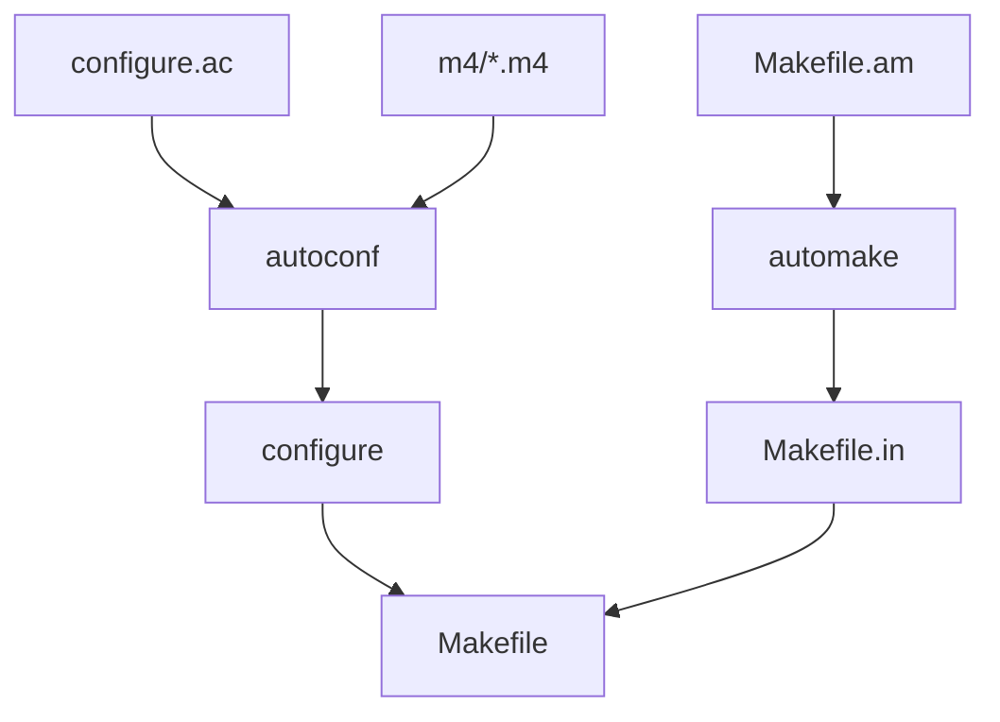

# Build System Map

This document describes the flow and structure of the `autotools`-based build system for this legacy fork.

## 1. Flow Diagram

## 2. Critical Files

### `configure.ac`
- Defines project metadata (`iperf 2.0.5`).
- Checks for C/C++ compiler and threading support (`Pthreads`).
- Performs feature detection (e.g., IPv6, Multicast, Web100).
- Generates `config.h` and Makefiles.

### `m4/dast.m4`
- Custom macros from the NLANR DAST team.
- Contains legacy checks for types and behaviors specific to the original iperf codebase.

### `src/Makefile.am`
- Defines the `iperf` binary and its sources.
- Links against `libcompat.a` from the `compat` directory.
- **[FIXED]** Now includes all necessary headers for clean distribution.

## 3. Build Targets
- `make`: Compiles the project.
- `make check`: Runs the `tests/reverse-matrix.sh` harness (legacy subset).
- `make distcheck`: **[FIXED]** Verifies distribution integrity by building from a clean tarball.
- `make install`: Installs binary and man pages.

## 4. Modernization Improvements
- Fixed `-Wformat-security` warnings across all modules.
- Ensured out-of-tree builds work correctly for CI.
- Modernized `EXTRA_DIST` to include new test and documentation files.
